# ActiveTrack

This is my third milestone project for the Code Institute Level 5 Diploma in Web Application Development. It was designed to implement CRUD functionality while ensuring responsiveness and accessibility across all devices. The project utilises HTML, CSS, JavaScript, and Python, along with Bootstrap and Jinja. It is a full-stack application built on a PostgreSQL relational database, utilising technologies such as Flask and SQLAlchemy with Psycopg2.

[View live webpage](https://activetrack-milestone-3-d2dff2fa8baa.herokuapp.com/)

## Project Goal

This project aims to develop a user-friendly, reliable, and secure exercise tracking website to help users monitor and enhance their fitness journey. The site will allow users to track their progress in various exercises, such as logging weights and reps for strength training or recording distance and time for endurance activities. Users will have access to detailed records of their achievements and personal bests to help set future goals. Additionally, the website will feature a community page where users can view and comment on each other's achievements, fostering a supportive and interactive environment.

### CRUD

This project meets CRUD functionality by:

#### Create

- Users can sign up and create an account.
- Users can log new activities.
- Users can add comments.

#### Read

- Users can view their own activity logs.
- Users can view activity logs of other users.
- Users can view their own comments.
- Users can view comments made by others.

#### Update

- Users can update their activity logs.

#### Delete

- Users can delete their activity logs.
- Users can delete their own comments.
- Users can delete comments from others on their own activity logs.

## User Experience (UX)

### Site Contents

- A home page with a welcome to the site.
- A login page for the user to log in.
- A sign up page for the user to sign up for an account.
- A diary page where the user can add, edit, delete or view their own activity logs.
- An add activity page where the user can add an activity log.
- An edit activity page where the user can edit an existing activity log.
- An activity feed page that shows other users activity logs.
- An error page.

### Target Audience

Fitness Enthusiasts
- Individuals who are passionate about fitness and consistently engage in various forms of exercise, such as weightlifting, running, cycling, and swimming and are wanting to track their progress to achieve personal goals.

Beginners in Fitness
- People who are new to fitness and who will benefit from a structured and easy-to-use platform to track their progress and stay motivated.

Competitive Athletes
- Athletes who participate in sports or competitive events and need a reliable way to monitor their training progress.

People with Specific Fitness Goals
- Individuals targeting specific fitness objectives, such as weight loss, muscle gain, or preparing for a marathon.

### User Stories

#### First time visitor
1. As a first-time visitor, I want to create an account quickly using my email so that I can start using the site immediately.
2. As a first-time visitor, I want to log my first activity easily so that I can start tracking my fitness activities right away.
3. As a first-time visitor, I want to be able to easily navigate the site.
4. As a first-time visitor, I want to know immediately what the site is for.

#### Registered visitor
5. As a registered visitor, I want to log in quickly using my credentials so that I can access my saved data.
6. As a registered visitor, I want to log different types of activities so that I can accurately track my exercise.
7. As a registered visitor, I want to see other users activities.
8. As a registered visitor, I want to be able to comment on other users activity logs.
9. As a registered visitor, I want to be able to delete my comments and other users comments on my own activity logs.
10. As a registered visitor, I want to be able to update my current activity logs and delete them.

#### Site owner
11. As a site owner, I want to provide a seamless onboarding experience for new users so that they can quickly and easily start using the app.
12. As a site owner, I want to create a community space within the app where users can interact and support each other.
13. As a site owner, I want to ensure there is sufficient defensive programming to prevent the user deleting data by mistake.
14. As a site owner, I want to ensure there is sufficient defensive programming to prevent a logged-out user from accessing areas of the site only accessible by being logged into an account.
15. As a site owner, I want to ensure there is sufficient defensive programming to guarantee that usernames and emails are unique during signup.

## Accessibility

The site has been built with accessibility in mind to ensure that it is always a positive experience.

This has been achieved by:
- Semantic HTML.
- Choosing fonts and colours with high contrast.
- Adequate aria-labels for interactive features.

## Design

### Imagery

A consistent design is maintained across the site by using the same background image on every page, aligning with the site's theme.

Attribution for the background image used for the site:
[Image by freepik](https://www.freepik.com/free-photo/top-view-perfectly-ordered-fitness-items_40483721.htm#fromView=search&page=5&position=12&uuid=5b9bb55e-33a3-4753-9d3f-3c1ce3062493)

### Wireframes

Home Page

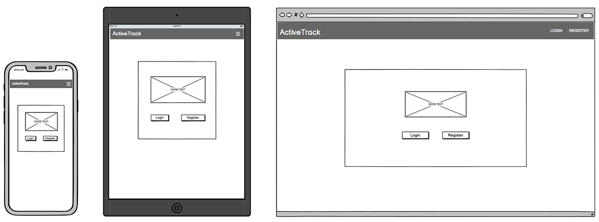

Login Page

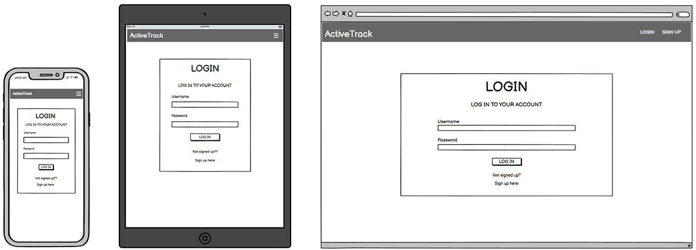

Sign Up Page

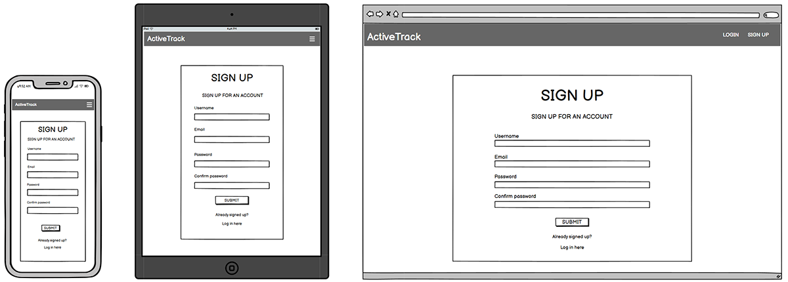

Diary Page

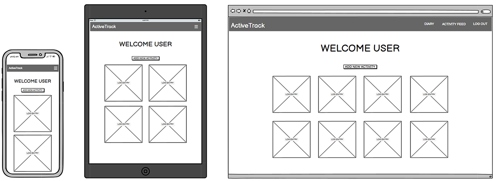

Activity Feed Page

Add/Edit Activity Page

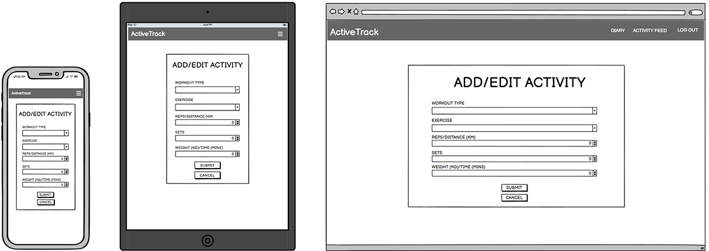

Activity Card

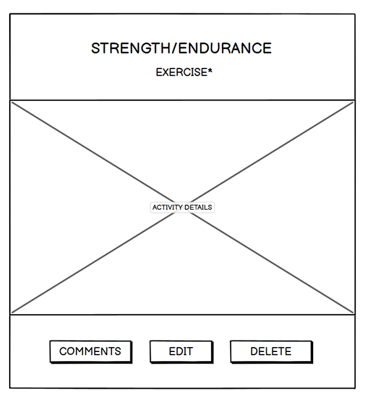

Comments Modal

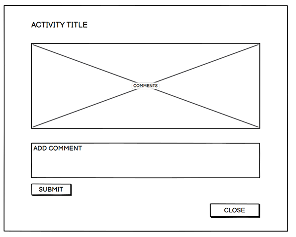

Delete Modal

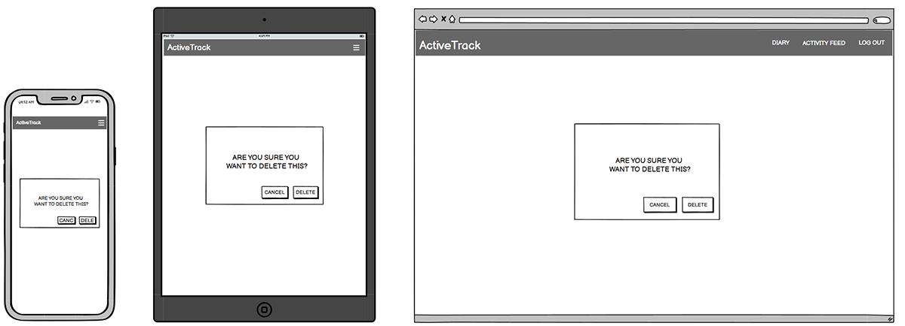

Error Page

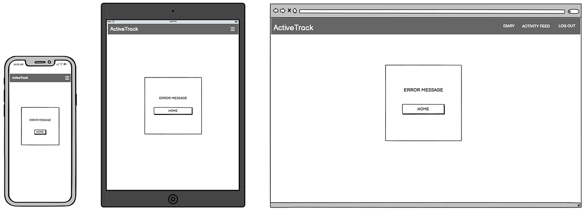

### Database

A relational database was implemented for this site, consisting of three tables: user, activity, and comment. PostgreSQL is the relational database used, employing one-to-many relationships with primary and foreign keys, and db.relationship to effectively manage the connections between the tables.

#### User Journey

Flowchart

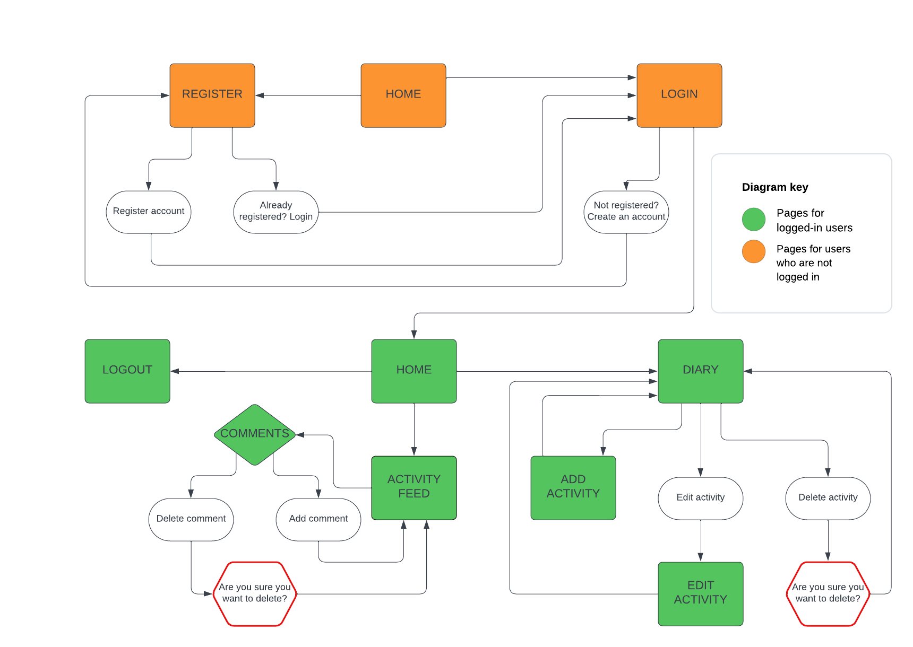

#### Schema

Table Schema

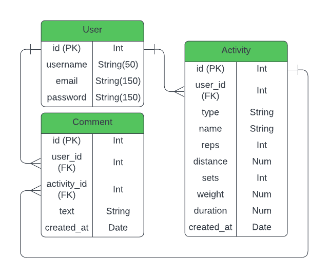

#### User Table

Represents a user in the database.

User passwords are stored in a hashed format using the werkzeug security library in Python.

- id: Unique identifier for each user, serves as the primary key.
- username: Unique string that identifies the user, used for login purposes.
- email: Unique email address for the user, used for signup.
- password: Encrypted password for user authentication.
- activities (relationship): Establishes a one-to-many relationship with the Activity model. A user can have multiple activities. The cascade="all, delete" ensures that when a user is deleted, all associated activities are also deleted.
- __repr__: Provides a human-readable representation of the user instance.

#### Activity Table

Represents an activity logged by a user.

- id: Unique identifier for each activity, serves as the primary key.
- user_id: Foreign key linking to the User table, indicates which user the activity belongs to. The ondelete="CASCADE" ensures that when a user is deleted, all their activities are also deleted.
- workout_type: Describes the type of workout (endurance or strength).
- exercise_name: Name of the exercise performed (e.g., running, bench press).
- reps: Number of repetitions performed (if applicable).
- distance: Distance covered during the activity (if applicable).
- sets: Number of sets performed (if applicable).
- weight: Weight used during the exercise (if applicable).
- duration: Duration of the activity (if applicable).
- created_at: Timestamp of when the activity was created, defaulting to the current time.
- comments (relationship): Establishes a one-to-many relationship with the Comment model. An activity can have multiple comments. The cascade="all, delete" ensures that when an activity is deleted, all associated comments are also deleted.
- __repr__: Provides a human-readable representation of the activity instance.

#### Comment Table

Represents a comment made by a user on a specific activity.

- id: Unique identifier for each comment, serves as the primary key.
- user_id: Foreign key linking to the User table, indicates which user made the comment. The ondelete="CASCADE" ensures that when a user is deleted, all their comments are also deleted.
- activity_id: Foreign key linking to the Activity table, indicates which activity the comment is related to. The ondelete="CASCADE" ensures that when an activity is deleted, all associated comments are also deleted.
- comment_text: The actual text of the comment.
- created_at: Timestamp of when the comment was created, defaulting to the current time.
- user (relationship): Establishes a many-to-one relationship with the User model, allowing access to the user who made the comment.
- __repr__: Provides a human-readable representation of the comment instance.

### Typography

The following Google Fonts were used on this site:

- Bebas Neue is used for the headings on the site.

- Oswald is used for the main text of the site.

Both of these fonts look professional and are easy to read.

### Colour Scheme

The site utilises a black and white colour scheme for a clean, clear, and visually appealing design.

## Content

I created a JSON file containing endurance and strength exercises. This is used on the add activity page, where the exercises select box populates with relevant options based on the selected workout type.

## Features

### Features On Each Page

#### Navbar

Each page features a navbar containing the site heading and links to various pages. The links displayed vary based on the user's login status. The navbar adjusts based on the device the user is using.

Desktop Logged In

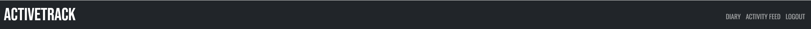

Desktop Logged Out

Mobile Logged In

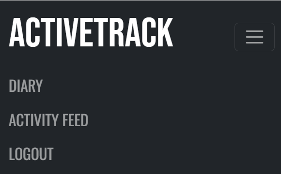

Mobile Logged Out

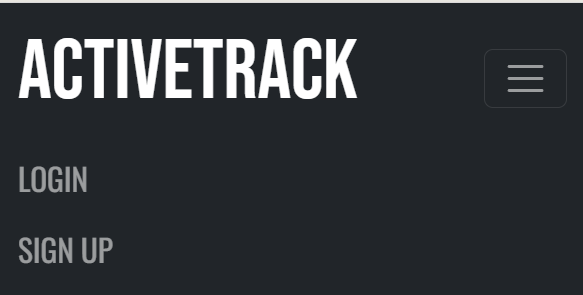

User Stories: 3

#### Home Page

The home page greets the user with a personalized welcome message that includes their username. It also provides an introduction to the site and links to other pages, which vary based on the user's login status.

Logged In

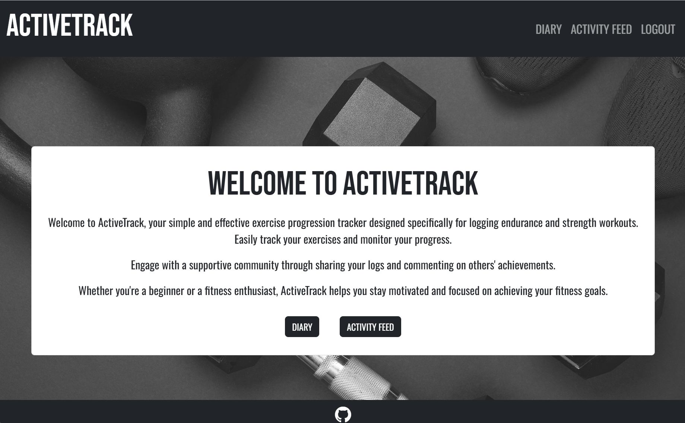

Logged Out

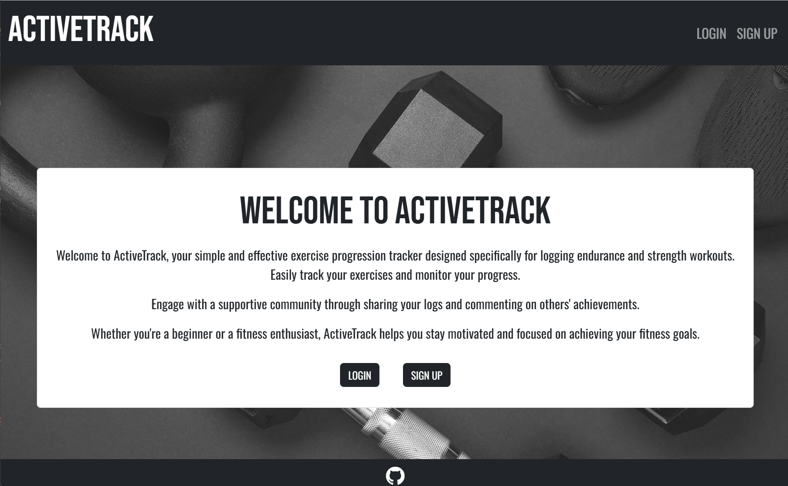

User Stories: 3, 4

#### Sign Up Page

The sign-up page includes a form for users to create an account. It employs defensive programming to ensure usernames and emails are unique and not already in the database. Additionally, the password fields have character length limitations.

Preview

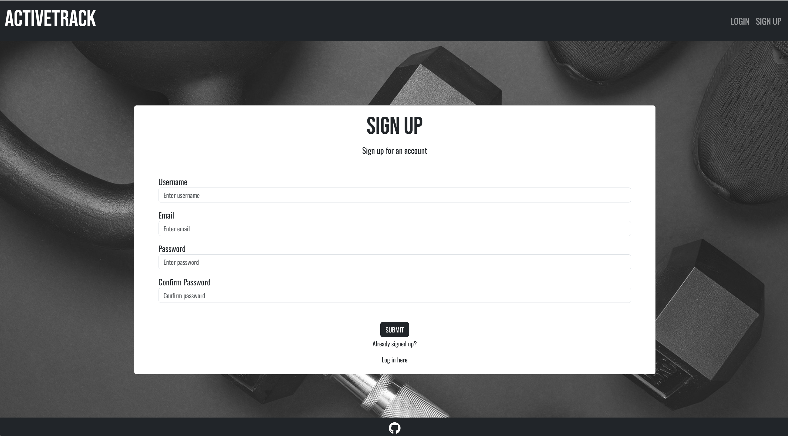

User Stories: 1, 11, 15

#### Login Page

The login page includes a form for users to enter their existing credentials to access their account.

Preview

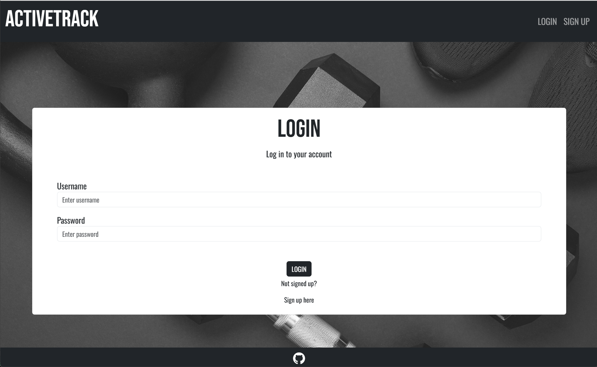

User Stories: 5, 14

#### Diary Page

The diary page greets the user by displaying their username and includes a button to add an activity log. Once a log is added, it appears below the welcome message. The layout of the activity log cards is responsive, switching from rows to columns based on screen size. Each activity log card displays all the logged information and the time it was created. Additionally, each card features three buttons: Comments, Edit, and Delete. The Comments button shows any comments made on the activity, the Edit button allows the user to modify the log, and the Delete button removes it.

Preview

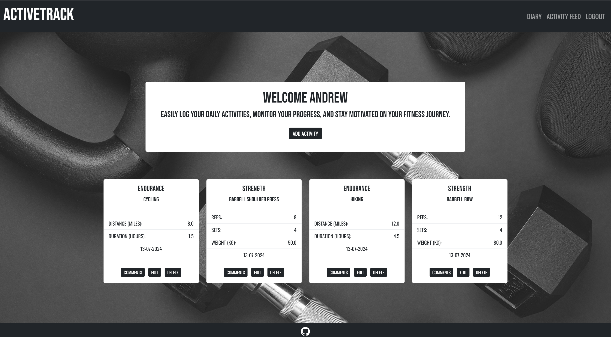

User Stories: 2, 6, 10

#### Add/Edit Activity Page

The add activity page includes a form for users to log an activity. Users can select the type of exercise, either endurance or strength, which populates the exercise dropdown with relevant options. This functionality is implemented using JavaScript, with exercise data provided via a JSON file. The edit page uses the same form structure, but the workout type and exercise fields are fixed and cannot be modified.

Add Activity

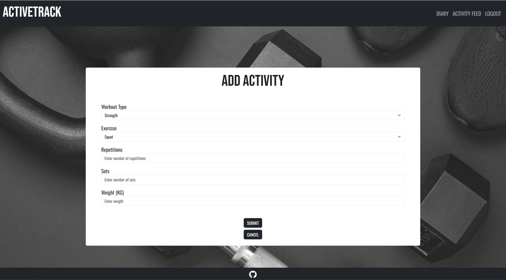

Edit Activity

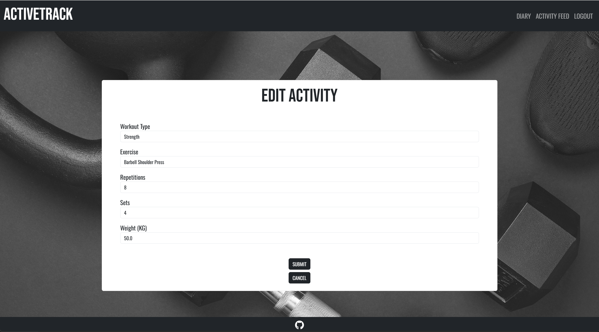

User Stories: 2, 6, 10

#### Activity Feed Page

The activity feed page displays all users' activity logs. Each card shows the details of an activity and includes a Comments button, allowing users to view, add, and delete comments. Similar to the diary page, the layout is responsive, adjusting to show in rows or columns based on the device.

Preview

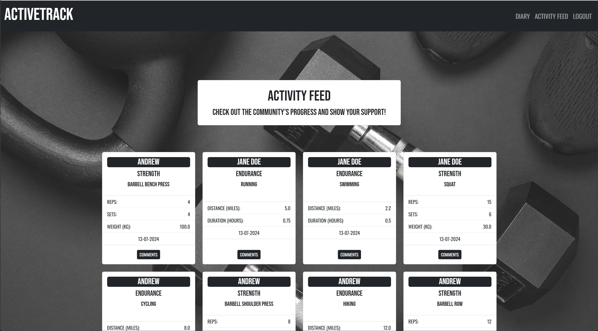

User Stories: 7, 8, 12

#### Comments Modal

The comments modal appears when a user clicks the Comments button on an activity log card, whether on their own logs in the diary page or others' logs in the activity feed page. The modal displays all comments made on that particular activity log. Users can delete their own comments, and the owner of the activity log can delete comments made by others. The modal also includes a text area form for users to write and submit new comments.

Preview

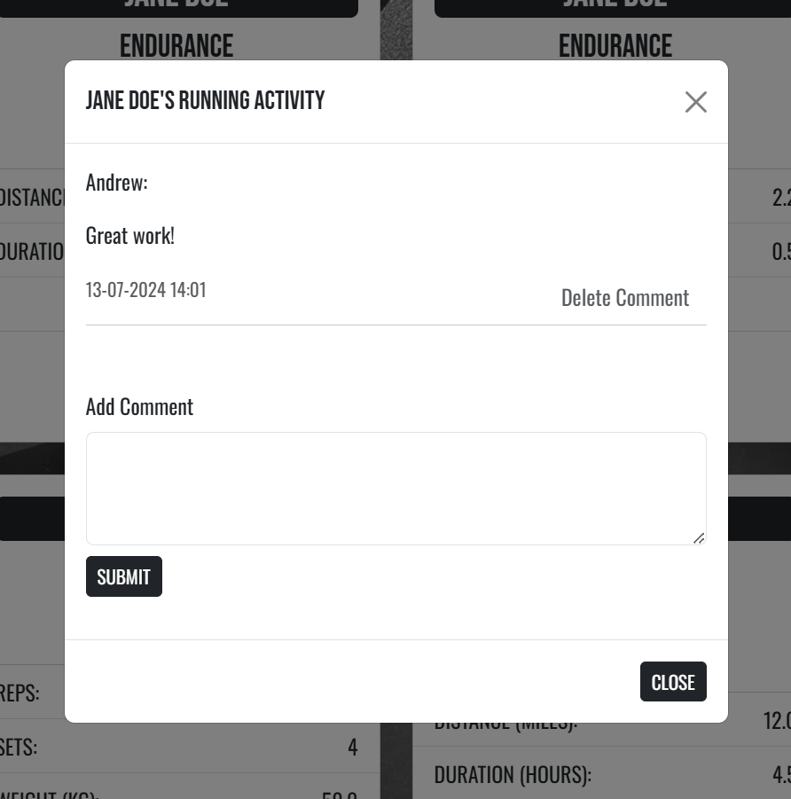

User Stories: 8, 9, 12

#### Delete Modal

The delete modal appears when a user attempts to delete an activity or a comment. This serves as a defensive programming measure to prevent accidental deletions.

Preview

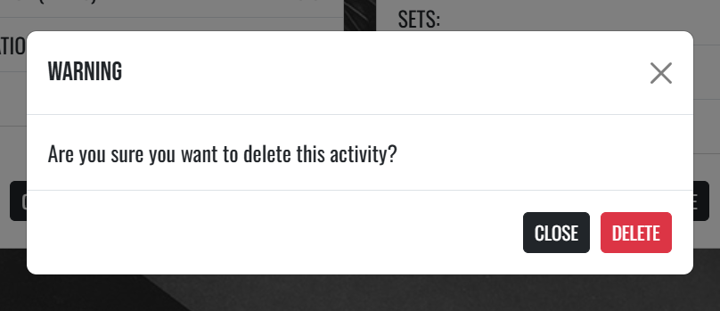

User Stories: 9, 10, 13

#### Error Pages

The content of the error pages varies based on the specific error encountered. This is achieved by using a variable declared within the route, which holds the appropriate message for each error.

Preview

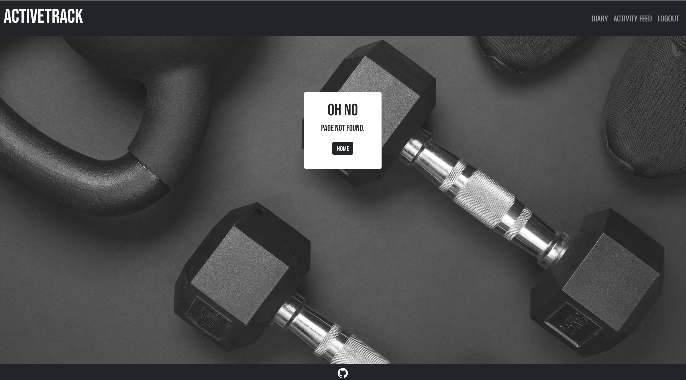

User Stories: 14

## Future Implementations

- Profile Creation: Implement user profiles that can be customised with photos, bios, and personal information.
- Profile Editing: Allow users to update their details, such as username, email, and password.
- Account Deletion: Enable users to delete their accounts if they choose to do so.
- Liking Activities: Allow users to like activities shared by others.
- Following Users: Implement a feature for users to follow other users to stay updated on their activities.
- Search Capabilities: Add a search feature that allows users to find specific posts based on workout types, exercises, or other users.
- Dynamic Comment Population: Upon comment submission, the modal will automatically generate and display the new comment without reloading the page.
- More Exercise Options: Update the exercises JSON file or use an API to provide users with a wider selection of exercises.

## Technologies Used

### Languages

#### HTML

- Used to create the structure of the site.

#### CSS

- Used for the styling of the site.

#### JavaScript

- Used to dynamically populate the exercises within the add activity form based on the selected workout type, ensuring the exercises select menu updates with appropriate values.

#### Python

- Used for developing the backend of the application.

#### Jinja Templating Language

- Used alongside Python and Flask to dynamically display content.

### Frameworks

#### Bootstrap 5

- Used to easily build pages with a responsive and stylish design.

#### Flask

- Used for backend development of the application, including user session management with Flask-Login.

### Libraries

#### SQLAlchemy

- ORM used with Python to work with postgreSQL.

#### Werkzeug

- Used to provide security features for the app, including functionality for password hashing.

### Database

#### PostgeSQL

- Used as the relational database for the app.

### Software/Apps Used

- [Chrome Developer Tools](https://developer.chrome.com/docs/devtools)
- [JSHint](https://jshint.com/)
- [Code Institute Python Linter](https://pep8ci.herokuapp.com/)
- [Balsamiq](https://balsamiq.com/wireframes/)
- [Tiny PNG](https://tinypng.com/)
- [Adobe Photoshop](https://www.adobe.com/uk/)
- [Google Fonts](https://fonts.google.com/about)
- [Bootstrap Icons](https://icons.getbootstrap.com/)
- [Git](https://git-scm.com/)
- [Github](https://github.com/)
- [GitPod](https://www.gitpod.io/)
- [Favicon](https://favicon.io/)
- [Jira Software](https://www.atlassian.com/software/jira)
- [Am I Responsive](https://ui.dev/amiresponsive)
- [YouTube](https://www.youtube.com/)

## Deployment

### Local Deployment

#### Fork

Forking a project creates a completely separate codebase and allows a user to make local changes to a project without affecting the original repository itself.

To fork the repository:

1. When logged into GitHub, locate and access the [repository.](https://github.com/collingsandrew/milestone-project-3)
2. At the top right of the repository, there will be a 'fork' option.

#### Clone

Cloning a project allows a user to make contributions to the main repository, with permission.

To clone the repository:

1. When logged into GitHub, locate and access the [repository.](https://github.com/collingsandrew/milestone-project-3)
2. Above your files to the right, select the 'code' drop down button and select either HTTPS, SSH or GitHub CLI and then copy the URL below.
3. Then, in your chosen code editor, change the current working directory to the location you would like the cloned repository to be located.
4. In the terminal, type <code>git clone</code> and paste the URL that you copied earlier, and then press enter.
5. Create an env.py file within the root directory of the project and enter the following example code, ensuring you enter your relevant values.

<code>import os</code> 

<code>os.environ.setdefault("IP", "ADD YOUR IP HERE")</code> 
<code>os.environ.setdefault("PORT", "ADD YOUR PORT HERE")</code> 
<code>os.environ.setdefault("SECRET_KEY", "ADD_YOUR_SECRET_KEY_HERE")</code> 
<code>os.environ.setdefault("DEBUG", "True")</code> 
<code>os.environ.setdefault("DEVELOPMENT", "True")</code> 
<code>os.environ.setdefault("DB_URL", "postgresql:///activetrack")</code> 

6. Install the packages required by typing <code>pip3 install -r requirements.txt</code> in the terminal.

#### Creating the database

To create your local database enter the following commands in the terminal:

<code>psql</code> 
<code>CREATE DATABASE activetrack;</code> 
<code>\c activetrack;</code> 

You will then be prompted that you have connected to database 'activetrack'. 
__Enter <code>\q</code> to exit psql.__

Then you need to populate the database with the table models for the app. 
To do this enter the following commands in the terminal:

<code>python3</code> 
<code>from activetrack import db</code> 
<code>db.create_all()</code> 
<code>exit()</code> 

To check your tables exist in the database enter the following commands in the terminal:

<code>psql -d activetrack</code> 
<code>\dt</code> 

This should show the models in the models.py file within a table. 
__Enter <code>\q</code> to exit psql.__

__To run the application enter <code>python3 run.py</code> into the terminal.__

### Deploying to Heroku

To deploy this application to Heroku:

1. If it doesn't already exist, create a file named ProcFile in the root directory and add the code <code>web: python app.py.</code> Ensuring that the Procfile has a capital 'P' and does not have a blank line at the end of the file.
2. If it doesn't already exist, create a requirements.txt file by running the command <code>pip freeze > requirements.txt</code> in the terminal.
3. Commit and push these two files to GitHub.
4. Sign up for an account on Heroku.
5. Log in and click __New__ and then __Create a new app__.
6. Give your application a unique name and choose the region closest to you.
7. Go to the __Settings__ tab of your new app.
8. Click __Reveal Config Vars__.
9. Fill the fields in with your relevant values __(you will need a database link)__ like the following:
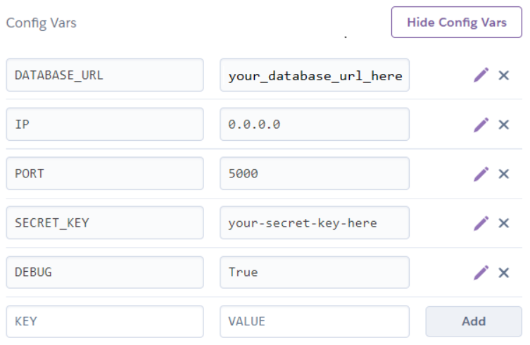

__DEBUG is only set temporarily in case we have any errors during deployment. This needs to be removed when debugging is finished.__

10. Navigate to the __Deploy__ tab of your app.
11. In the __Deployment method__ section, select __Connect to GitHub__.
12. Search for your repo and click __Connect__. Optional: You can click __Enable Automatic Deploys__ in case you make any further changes to the application. This will trigger any time code is pushed to your GitHub repository.
13. If all changes are pushed to GitHub, navigate to the __Manual Deploy__ section and click __Deploy Branch__. This will start the build process. When finished, it should look something like this:

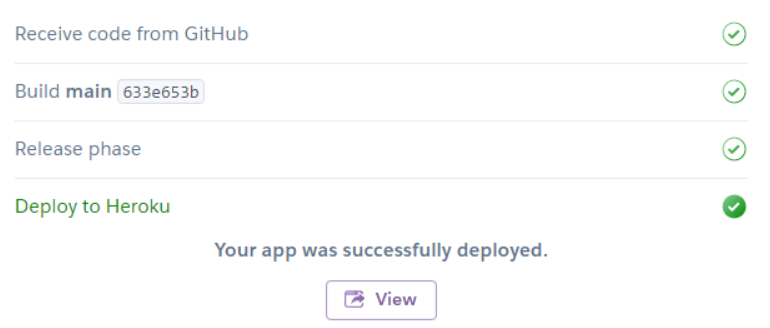

__Next, the tables need to be added to the database:__

1. Click the __More__ button and select __Run console__: 
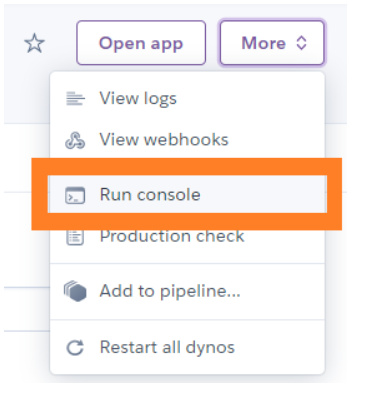
2. Type <code>python3</code> into the console and click __run__.
3. In the terminal type the following commands:
<code>from taskmanager import db</code> 
<code>db.create_all()</code> 
<code>exit()</code>

__If you make changes to the models anytime during development once deployed to Heroku, you will need to update the tables in the database.__ 

4. The app is now ready, use the __Open app__ button to open the app.

## Testing

Please refer to [TESTING.md](TESTING.md) for testing information and results.

## Bugs

### User could update another users activity log via URL

To prevent this I implemented a check to verify if the current user's ID matches the activity's user ID. If they do not match, the user is redirected to the home page with a flash error message indicating the issue.

Code used:

if activity.user_id != current_user.id:
    flash('You do not have permission to edit this activity.', category='error')
    return redirect(url_for('home'))

### Werkzeug Build Error

When trying to access a login required page as a user that is not logged in, the page was bringing up a werkzeug build error. The solution to this was changing the login_manager.login_view route from 'routes.home' to 'home'.

## Credits

- For the user account functionality - [Tech With Tim - YouTube](https://www.youtube.com/watch?v=dam0GPOAvVI&t=7192s)
- Used as a reference for the dynamic exercise select field on the add activity form (alongside the Code Institute material on 'Flask Framework: reading from a JSON file'.) - [By Pretty Printed - YouTube](https://www.youtube.com/watch?v=I2dJuNwlIH0)
- For the error handling functionality - [Stack Overflow](https://stackoverflow.com/questions/29516093/how-to-redirect-to-a-external-404-page-python-flask)
- The Code Institute material helped with the overall development of the site.
- For an explanation of function expressions: to pass jshint - [mdn web docs](https://developer.mozilla.org/en-US/docs/Web/JavaScript/Reference/Operators/function)

## Acknowledgements

- My mentor for guidance throughout the project.
- Code Institute for their course material.
- My cohort for help and support throughout the project.
- [Bro Code YouTube Channel](https://www.youtube.com/@BroCodez) for everything related to Python and a refresher on JavaScript.