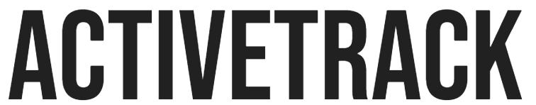

# ActiveTrack

## Project Goal

This project aims to develop a user-friendly, reliable, and secure exercise tracking website to help users monitor and enhance their fitness journey. The site will allow users to track their progress in various exercises, such as logging weights and reps for strength training or recording distance and time for endurance activities. Users will have access to detailed records of their achievements and personal bests to help set future goals. Additionally, the website will feature a community page where users can view and comment on each other's achievements, fostering a supportive and interactive environment.

## User Experience (UX)

### Site Contents

- A home page with a welcome to the site.
- A login page for the user to log in.
- A sign up page for the user to sign up for an account.
- A diary page where the user can add, edit, delete or view their own activity logs.
- An add activity page where the user can add an activity log.
- An edit activity page where the user can edit an existing activity log.
- An activity feed page that shows other users activity logs.
- An error page.

### Target Audience

Fitness Enthusiasts
- Individuals who are passionate about fitness and consistently engage in various forms of exercise, such as weightlifting, running, cycling, and swimming and are wanting to track their progress to achieve personal goals.

Beginners in Fitness
- People who are new to fitness and who will benefit from a structured and easy-to-use platform to track their progress and stay motivated.

Competitive Athletes
- Athletes who participate in sports or competitive events and need a reliable way to monitor their training progress.

People with Specific Fitness Goals
- Individuals targeting specific fitness objectives, such as weight loss, muscle gain, or preparing for a marathon.

### User Stories

#### First time visitor
1. As a first-time visitor, I want to create an account quickly using my email so that I can start using the site immediately.
2. As a first-time visitor, I want to log my first activity easily so that I can start tracking my fitness activities right away.
3. As a first-time visitor, I want to be able to easily navigate the site.
4. As a first-time visitor, I want to know immediately what the site is for.

#### Registered visitor
5. As a registered visitor, I want to log in quickly using my credentials so that I can access my saved data.
6. As a registered visitor, I want to log different types of activities so that I can accurately track my exercise.
7. As a registered visitor, I want to see other users activities.
8. As a registered visitor, I want to be able to comment on other users activity logs.
9. As a registered visitor, I want to be able to delete my comments and other users comments on my own activity logs.
10. As a registered visitor, I want to be able to update my current activity logs and add new logs.

#### Site owner
11. As a site owner, I want to provide a seamless onboarding experience for new users so that they can quickly and easily start using the app.
12. As a site owner, I want to create a community space within the app where users can interact and support each other.
13. As a site owner, I want to ensure there is sufficient defensive programming to prevent the user deleting data by mistake.
14. As a site owner, I want to ensure there is sufficient defensive programming to prevent a logged-out user from accessing areas of the site only accessible by being logged into an account.

## Accessibility

The site has been built with accessibility in mind to ensure that it is always a positive experience.

This has been achieved by:
- Semantic HTML.
- Choosing fonts and colours with high contrast.
- Adequate aria-labels for interactive features.

## Design

### Imagery

Attribution for the background image used for the site:
[Image by freepik](https://www.freepik.com/free-photo/top-view-perfectly-ordered-fitness-items_40483721.htm#fromView=search&page=5&position=12&uuid=5b9bb55e-33a3-4753-9d3f-3c1ce3062493)

### Wireframes

Home Page

Login Page

Sign Up Page

Diary Page

Activity Feed Page

Add/Edit Activity Page

Activity Card

Comments Modal

Delete Modal

Error Page

### Database

A relational database was implemented for this site, consisting of three tables: users, activities, and comments. PostgreSQL is the relational database used, employing one-to-many relationships with primary and foreign keys, and db.relationship to effectively manage the connections between the tables.

#### User Journey

Flowchart

#### Schema

Table Schema

### Typography

The following Google Fonts were used on this site:

- Bebas Neue is used for the headings on the site.

- Oswald is used for the main text of the site.

Both of these fonts look professional and are easy to read.

### Colour Scheme

The site utilizes a black and white colour scheme for a clean, clear, and visually appealing design.

## Features

### Features On Each Page