# ActiveTrack

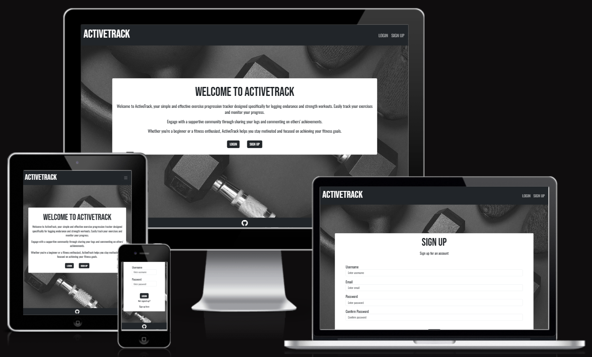

[View live webpage](https://activetrack-milestone-3-d2dff2fa8baa.herokuapp.com/)

## Testing

Testing was conducted continuously throughout the entire project development process. Google Developer Tools was used to highlight any issues during development.

Google Developer Tools was used to test the site on various device sizes.

The following devices were used to test the site:

- 32" (3840 x 2160) Desktop Monitor
- 15.6" (1920 x 1080) ASUS Laptop
- iPad Tablet
- Samsung S23 Mobile
- iPhone 12 Mobile

The following browsers were used to test the site:

- Google Chrome
- Mozilla Firefox
- Safari

### Code Validation

#### HTML Validation

[W3C Markup Validation Service](https://validator.w3.org/) was used to validate the HTML. No errors present.

Results:

[Home](https://validator.w3.org/nu/?doc=https%3A%2F%2Factivetrack-milestone-3-d2dff2fa8baa.herokuapp.com%2F)

[Sign Up](https://validator.w3.org/nu/?doc=https%3A%2F%2Factivetrack-milestone-3-d2dff2fa8baa.herokuapp.com%2Fsign-up)

[Login](https://validator.w3.org/nu/?doc=https%3A%2F%2Factivetrack-milestone-3-d2dff2fa8baa.herokuapp.com%2Flogin)

[Diary](https://validator.w3.org/nu/?doc=https%3A%2F%2Factivetrack-milestone-3-d2dff2fa8baa.herokuapp.com%2Fdiary)

[Activity Feed](https://validator.w3.org/nu/?doc=https%3A%2F%2Factivetrack-milestone-3-d2dff2fa8baa.herokuapp.com%2Factivity_feed)

[Add Activity](https://validator.w3.org/nu/?doc=https%3A%2F%2Factivetrack-milestone-3-d2dff2fa8baa.herokuapp.com%2Fadd_activity)

[Edit Activity](https://validator.w3.org/nu/?doc=https%3A%2F%2Factivetrack-milestone-3-d2dff2fa8baa.herokuapp.com%2Fedit_activity%2F2)

#### CSS Validation

[W3C CSS Validation Service](https://jigsaw.w3.org/css-validator/) was used to validate the CSS. No errors present.

[Home](https://jigsaw.w3.org/css-validator/validator?uri=https%3A%2F%2Factivetrack-milestone-3-d2dff2fa8baa.herokuapp.com%2F&profile=css3svg&usermedium=all&warning=1&vextwarning=&lang=en)

[Sign Up](https://jigsaw.w3.org/css-validator/validator?uri=https%3A%2F%2Factivetrack-milestone-3-d2dff2fa8baa.herokuapp.com%2Fsign-up&profile=css3svg&usermedium=all&warning=1&vextwarning=&lang=en)

[Login](https://jigsaw.w3.org/css-validator/validator?uri=https%3A%2F%2Factivetrack-milestone-3-d2dff2fa8baa.herokuapp.com%2Flogin&profile=css3svg&usermedium=all&warning=1&vextwarning=&lang=en)

[Diary](https://jigsaw.w3.org/css-validator/validator?uri=https%3A%2F%2Factivetrack-milestone-3-d2dff2fa8baa.herokuapp.com%2Fdiary&profile=css3svg&usermedium=all&warning=1&vextwarning=&lang=en)

[Activity Feed](https://jigsaw.w3.org/css-validator/validator?uri=https%3A%2F%2Factivetrack-milestone-3-d2dff2fa8baa.herokuapp.com%2Factivity_feed&profile=css3svg&usermedium=all&warning=1&vextwarning=&lang=en)

[Add Activity](https://jigsaw.w3.org/css-validator/validator?uri=https%3A%2F%2Factivetrack-milestone-3-d2dff2fa8baa.herokuapp.com%2Fadd_activity&profile=css3svg&usermedium=all&warning=1&vextwarning=&lang=en)

[Edit Activity](https://jigsaw.w3.org/css-validator/validator?uri=https%3A%2F%2Factivetrack-milestone-3-d2dff2fa8baa.herokuapp.com%2Fedit_activity%2F3&profile=css3svg&usermedium=all&warning=1&vextwarning=&lang=en)

#### JavaScript Validation

[JSHint](https://jshint.com/) was used to validate the Javascript files. No issues present.

script.js

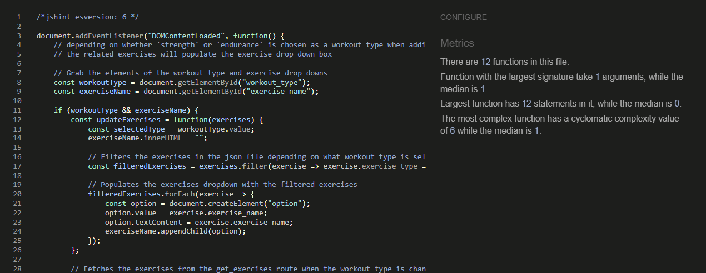

#### Python Validation

[pep8ci Python Linter](https://pep8ci.herokuapp.com/) was used to validate the Python files and ensure pep8 compliance. No issues present.

init.py

models.py

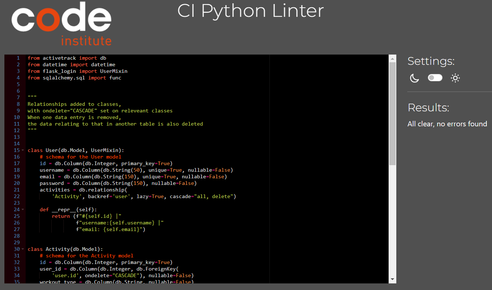

routes.py

### Accessibility

[WAVE Web Accessibility Tool](https://wave.webaim.org/) was used to test for accessibility errors.

The login functionality restricts WAVE, limiting its access to certain links. However, the following pages were testable, all of which showed no errors or contrast issues. Since the untested pages follow the same code and design principles, the tested pages indicate that the site's pages are built with optimal accessibility.

[Home](https://wave.webaim.org/report#/https://activetrack-milestone-3-d2dff2fa8baa.herokuapp.com/)

[Sign Up](https://wave.webaim.org/report#/https://activetrack-milestone-3-d2dff2fa8baa.herokuapp.com/sign-up)

[Login](https://wave.webaim.org/report#/https://activetrack-milestone-3-d2dff2fa8baa.herokuapp.com/login)

### Lighthouse Testing

Google Lighthouse was used to test all pages. All pages performed well.

Home Mobile

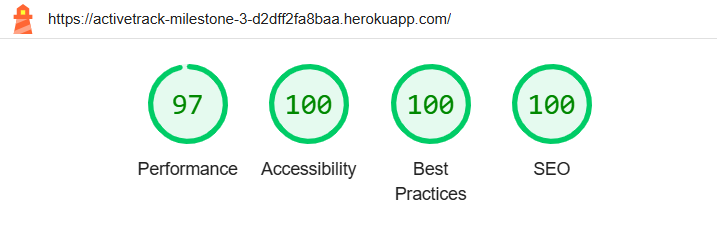

Home Desktop

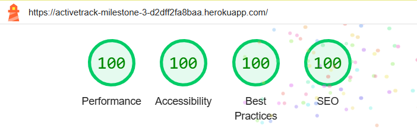

Sign Up Mobile

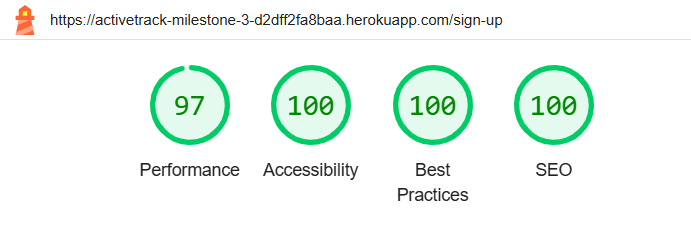

Sign Up Desktop

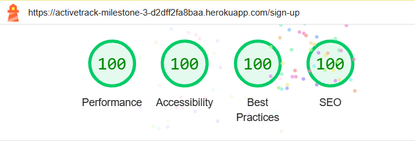

Login Mobile

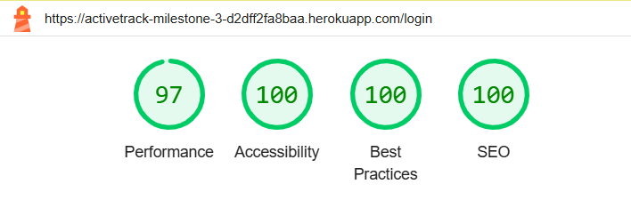

Login Desktop

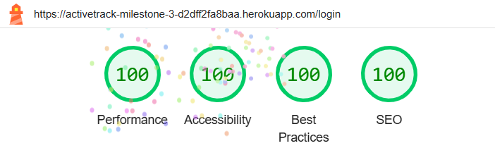

Diary Mobile

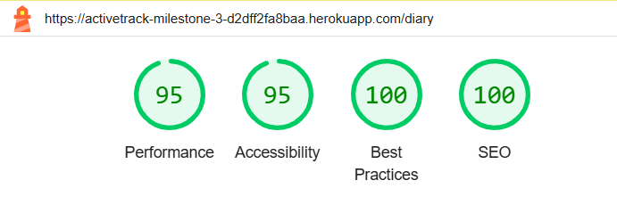

Diary Desktop

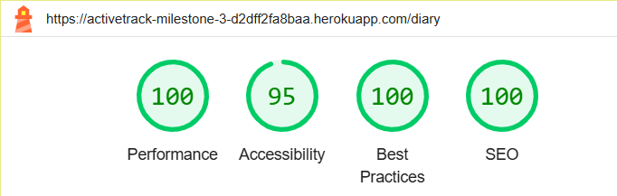

Activity Feed Mobile

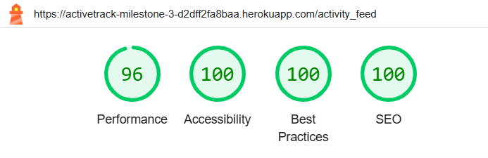

Activity Feed Desktop

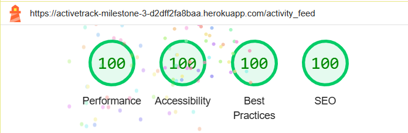

Add Activity Mobile

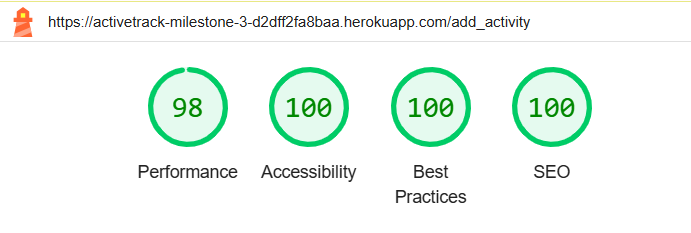

Add Activity Desktop

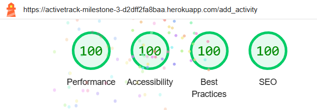

Edit Activity Mobile

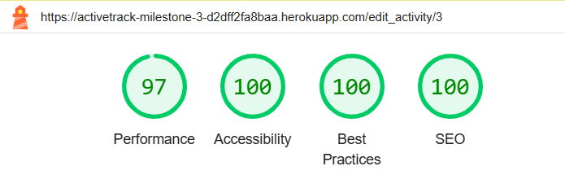

Edit Activity Desktop

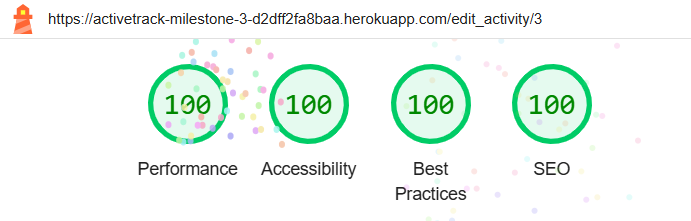

### Feature Testing

| Feature | Testing Performed                                                   | Pass/Fail |
| ------- | ------------------------------------------------------------------- | --------- |
| Links   | Check that all links navigate to the correct page                   | Pass      |
| Buttons | Check all buttons generate correct action                           | Pass      |
| Modals  | Check all modals appear when expected                               | Pass      |
| Flash Messages | Check flash messages appear upon user actions ie logged in   | Pass      |
| Create  | Check a user account can be created (sign up)                       | Pass      |
| Create  | Check a user can create an activity log                             | Pass      |
| Create  | Check a user can create a comment                                   | Pass      |
| Read    | Check the users own activity logs are shown in diary                | Pass      |
| Read    | Check other users activities are viewable on the activity feed      | Pass      |
| Read    | Check user can view their own comments on their own activity logs   | Pass      |
| Read    | Check users can view their comments on other users activity logs    | Pass      |
| Read    | Check users can view other users comments on their own activity logs | Pass      |
| Read    | Check users can view other users comments on other users activity logs | Pass      |
| Update  | Check users can update their own activity logs                      | Pass      |
| Delete  | Check users can delete their own activity logs                      | Pass      |
| Delete  | Check users can delete their own comments only                      | Pass      |
| Delete  | Check users can delete other users comments from their own activity logs | Pass      |
| JavaScript/JSON | Check form fields update with JSON data when workout type is changed | Pass      |
| Logout  | Check that user is returned to home page with only logged out viewable links | Pass |

### Error Handling Testing

| Action  | Testing Performed                                                   | Expected Outcome   | Pass/Fail |
| ------- | ------------------------------------------------------------------- | ------------------ | --------- |
| Sign Up | Enter username less than 3 characters                               | Flash error message| Pass      |
| Sign Up | Enter username that already exists                                  | Flash error message| Pass      |
| Sign Up | Enter email less than 4 characters                                  | Flash error message| Pass      |
| Sign Up | Enter email that already exists                                     | Flash error message| Pass      |
| Sign Up | Enter password that is too short                                    | Flash error message| Pass      |
| Sign Up | Enter passwords that do not match                                   | Flash error message| Pass      |
| Login   | Enter username that does not exist                                  | Flash error message| Pass      |
| Login   | Enter incorrect password                                            | Flash error message| Pass      |
| Add activity | Leave fields blank and submit                                  | Value of 0 is submitted | Pass |
| Add comment | Leave comment field blank and submit                            | Required message appears | Pass |
| Error Page | Example 404 error                                                | Directs to error page | Pass   |

### Security Testing

| Check        | Testing Performed                                             | Expected Outcome | Pass/Fail |
| ------------ | ------------------------------------------------------------- | ---------------- | --------- |
| Unauthorised | Check user cannot access a logged in users url/page           | Redirect to home page with flash message | Pass |
| Unauthorised | Check user cannot access another users edit activity page     | Flash error message | Pass |
| Logged Out   | Check logged out user can only view login and sign up links   | Only login and signup shown | Pass |
| Logged In    | Check logged in user can view diary, activity feed and logout links | Diary, Activity Feed, Logout shown | Pass |

### Responsiveness Testing

| Device | Resonsive |
| ------ | --------- |
| Mobile | Yes |
| Tablet | Yes |
| Laptop | Yes |
| Desktop 32" | Yes |

### Testing User Stories

#### First time visitor

1. As a first-time visitor, I want to create an account quickly using my email so that I can start using the site immediately.

| Feature  | Testing Performed                                                   | Expected Outcome   | Pass/Fail |
| -------- | ------------------------------------------------------------------- | ------------------ | --------- |
| Sign Up Link/s | Click link/s                                                  | Direct to Sign Up Page | Pass |
| Sign Up Form   | Fill out form and click submit                                | Direct to Login page with flash message | Pass |

2. As a first-time visitor, I want to log my first activity easily so that I can start tracking my fitness activities right away.

| Feature  | Testing Performed                                                   | Expected Outcome   | Pass/Fail |
| -------- | ------------------------------------------------------------------- | ------------------ | --------- |
| Diary Link/s | Click link/s                                                    | Direct to Diary page | Pass |
| Add Activity Link | Click link                                                 | Direct to Add Activity page | Pass |
| Add Activity Form | Fill out form and click submit                             | Direct to Diary page with flash message with activity logged to page | Pass |

3. As a first-time visitor, I want to be able to easily navigate the site.

| Feature  | Testing Performed                                                   | Expected Outcome   | Pass/Fail |
| -------- | ------------------------------------------------------------------- | ------------------ | --------- |
| Home Page | Links to relevant pages                                            | Easy Navigation    | Pass |
| Navbar    | Links to relevant pages                                            | Easy Navigation    | Pass |

4. As a first-time visitor, I want to know immediately what the site is for.

| Feature  | Testing Performed                                                   | Expected Outcome   | Pass/Fail |
| -------- | ------------------------------------------------------------------- | ------------------ | --------- |
| Home Page | Shows an introduction to the site and its purpose                  | Welcome message explains the use of the site | Pass |

#### Registered visitor

5. As a registered visitor, I want to log in quickly using my credentials so that I can access my saved data.

| Feature  | Testing Performed                                                   | Expected Outcome   | Pass/Fail |
| -------- | ------------------------------------------------------------------- | ------------------ | --------- |
| Login Link/s | Click link/s                                                    | Direct to Login Page | Pass |
| Login Form   | Fill out form and click submit                                  | Direct to Diary page with flash message | Pass |

6. As a registered visitor, I want to log different types of activities so that I can accurately track my exercise.

| Feature  | Testing Performed                                                   | Expected Outcome   | Pass/Fail |
| -------- | ------------------------------------------------------------------- | ------------------ | --------- |
| Diary Link/s | Click link/s                                                    | Direct to Diary page | Pass |
| Add Activity Link | Click link                                                 | Direct to Add Activity page | Pass |
| Add Activity Form | Fill out form and click submit                             | Direct to Diary page with flash message with activity logged to page | Pass |

7. As a registered visitor, I want to see other users activities.

| Feature  | Testing Performed                                                   | Expected Outcome   | Pass/Fail |
| -------- | ------------------------------------------------------------------- | ------------------ | --------- |
| Activity Feed Link/s | Click link/s                                            | Direct to Activity Feed page | Pass |
| Activity Feed Page | View Activity Feed page                                   | View other users activity logs | Pass |

8. As a registered visitor, I want to be able to comment on other users activity logs.

| Feature  | Testing Performed                                                   | Expected Outcome   | Pass/Fail |
| -------- | ------------------------------------------------------------------- | ------------------ | --------- |
| Comments Button | Click comments button                                        | Comments modal appears | Pass  |
| Add Comment     | Add comment to text field and click submit button            | Reload page with flash message with comment added to activity log | Pass |

9. As a registered visitor, I want to be able to delete my comments and other users comments on my own activity logs.

| Feature  | Testing Performed                                                   | Expected Outcome   | Pass/Fail |
| -------- | ------------------------------------------------------------------- | ------------------ | --------- |
| Comments Button | Click comments button                                        | Comments modal appears | Pass  |
| Delete Comment     | Click delete button                                       | Delete modal appears   | Pass |
| Delete Comment     | Click delete button on delete modal                       | Reloads page with flash message and comment deleted | Pass |

10. As a registered visitor, I want to be able to update my current activity logs and delete them.

| Feature  | Testing Performed                                                   | Expected Outcome   | Pass/Fail |
| -------- | ------------------------------------------------------------------- | ------------------ | --------- |
| Delete Activity Button | Click Delete button on activity log card              | Delete modal appears | Pass    |
| Delete Activity Log | Click Delete button on delete modal                      | Reloads page with flash message and activity log deleted | Pass |
| Edit Button   | Click Edit button on activity log card                         | Directs to edit activity page | Pass |
| Edit Activity Page| Edit activity fields and submit form                       | Directs to diary page with flash message and activity updated | Pass |

#### Site owner

11. As a site owner, I want to provide a seamless onboarding experience for new users so that they can quickly and easily start using the app.

- Users can quickly navigate to a sign-up page where they can easily register using their email, and choose a username and password.

12. As a site owner, I want to create a community space within the app where users can interact and support each other.

- Registered users can access the activity feed page to view other users' activity logs and comment to show their support.

13. As a site owner, I want to ensure there is sufficient defensive programming to prevent the user deleting data by mistake.

- Whenever a registered user attempts to delete anything on the site, such as an activity or comment, a modal prompts them to confirm if they want to proceed with the deletion.

14. As a site owner, I want to ensure there is sufficient defensive programming to prevent a logged-out user from accessing areas of the site only accessible by being logged into an account.

- The site is designed to display specific links based on the user's login status. It uses Flask-Login to manage access to pages, specifying whether a user needs to be logged in. Error handling has been implemented to show flash messages to the user and/or redirect them to relevant or error pages.

15. As a site owner, I want to ensure there is sufficient defensive programming to guarantee that usernames and emails are unique during signup.

- If statements are used during the signup process to ensure that the same username and/or email cannot be used more than once.

## Bugs

### Solved

### User could update another users activity log via URL

To prevent this I implemented a check to verify if the current user's ID matches the activity's user ID. If they do not match, the user is redirected to the home page with a flash error message indicating the issue.

Code used:

if activity.user_id != current_user.id:
    flash('You do not have permission to edit this activity.',
         category='error')
    return redirect(url_for('home'))

### Werkzeug Build Error

When trying to access a login required page as a user that is not logged in, the page was bringing up a werkzeug build error. The solution to this was changing the login_manager.login_view route from 'routes.home' to 'home'.