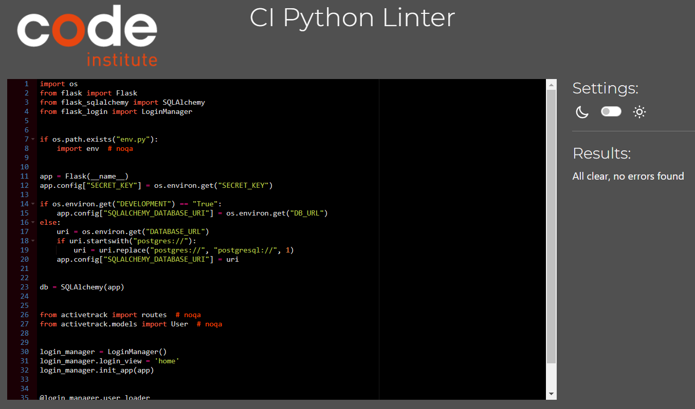

# ActiveTrack

[View live webpage](https://activetrack-milestone-3-d2dff2fa8baa.herokuapp.com/)

## Testing

Testing was conducted continuously throughout the entire project development process. Google Developer Tools was used to highlight any issues during development.

Google Developer Tools was used to test the site on various device sizes.

The following devices were used to test the site:

- 32" (3840 x 2160) Desktop Monitor
- 15.6" (1920 x 1080) ASUS Laptop
- iPad Tablet
- Samsung S23 Mobile
- iPhone 12 Mobile

The following browsers were used to test the site:

- Google Chrome
- Mozilla Firefox
- Safari

### Code Validation

#### HTML Validation

[W3C Markup Validation Service](https://validator.w3.org/) was used to validate the HTML. No errors present.

Results:

[Home](https://validator.w3.org/nu/?doc=https%3A%2F%2Factivetrack-milestone-3-d2dff2fa8baa.herokuapp.com%2F)

[Sign Up](https://validator.w3.org/nu/?doc=https%3A%2F%2Factivetrack-milestone-3-d2dff2fa8baa.herokuapp.com%2Fsign-up)

[Login](https://validator.w3.org/nu/?doc=https%3A%2F%2Factivetrack-milestone-3-d2dff2fa8baa.herokuapp.com%2Flogin)

[Diary](https://validator.w3.org/nu/?doc=https%3A%2F%2Factivetrack-milestone-3-d2dff2fa8baa.herokuapp.com%2Fdiary)

[Activity Feed](https://validator.w3.org/nu/?doc=https%3A%2F%2Factivetrack-milestone-3-d2dff2fa8baa.herokuapp.com%2Factivity_feed)

[Add Activity](https://validator.w3.org/nu/?doc=https%3A%2F%2Factivetrack-milestone-3-d2dff2fa8baa.herokuapp.com%2Fadd_activity)

[Edit Activity](https://validator.w3.org/nu/?doc=https%3A%2F%2Factivetrack-milestone-3-d2dff2fa8baa.herokuapp.com%2Fedit_activity%2F2)

#### CSS Validation

[W3C CSS Validation Service](https://jigsaw.w3.org/css-validator/) was used to validate the CSS. No errors present.

[Home](https://jigsaw.w3.org/css-validator/validator?uri=https%3A%2F%2Factivetrack-milestone-3-d2dff2fa8baa.herokuapp.com%2F&profile=css3svg&usermedium=all&warning=1&vextwarning=&lang=en)

[Sign Up](https://jigsaw.w3.org/css-validator/validator?uri=https%3A%2F%2Factivetrack-milestone-3-d2dff2fa8baa.herokuapp.com%2Fsign-up&profile=css3svg&usermedium=all&warning=1&vextwarning=&lang=en)

[Login](https://jigsaw.w3.org/css-validator/validator?uri=https%3A%2F%2Factivetrack-milestone-3-d2dff2fa8baa.herokuapp.com%2Flogin&profile=css3svg&usermedium=all&warning=1&vextwarning=&lang=en)

[Diary](https://jigsaw.w3.org/css-validator/validator?uri=https%3A%2F%2Factivetrack-milestone-3-d2dff2fa8baa.herokuapp.com%2Fdiary&profile=css3svg&usermedium=all&warning=1&vextwarning=&lang=en)

[Activity Feed](https://jigsaw.w3.org/css-validator/validator?uri=https%3A%2F%2Factivetrack-milestone-3-d2dff2fa8baa.herokuapp.com%2Factivity_feed&profile=css3svg&usermedium=all&warning=1&vextwarning=&lang=en)

[Add Activity](https://jigsaw.w3.org/css-validator/validator?uri=https%3A%2F%2Factivetrack-milestone-3-d2dff2fa8baa.herokuapp.com%2Fadd_activity&profile=css3svg&usermedium=all&warning=1&vextwarning=&lang=en)

[Edit Activity](https://jigsaw.w3.org/css-validator/validator?uri=https%3A%2F%2Factivetrack-milestone-3-d2dff2fa8baa.herokuapp.com%2Fedit_activity%2F3&profile=css3svg&usermedium=all&warning=1&vextwarning=&lang=en)

#### JavaScript Validation

[JSHint](https://jshint.com/) was used to validate the Javascript files. No issues present.

script.js

#### Python Validation

[pep8ci Python Linter](https://pep8ci.herokuapp.com/) was used to validate the Python files and ensure pep8 compliance. No issues present.

init.py

models.py

routes.py

### Accessibility

[WAVE Web Accessibility Tool](https://wave.webaim.org/) was used to test for accessibility errors.

The login functionality restricts WAVE, limiting its access to certain links. However, the following pages were testable, all of which showed no errors or contrast issues. Since the untested pages follow the same code and design principles, the tested pages indicate that the site's pages are built with optimal accessibility.

[Home](https://wave.webaim.org/report#/https://activetrack-milestone-3-d2dff2fa8baa.herokuapp.com/)

[Sign Up](https://wave.webaim.org/report#/https://activetrack-milestone-3-d2dff2fa8baa.herokuapp.com/sign-up)

[Login](https://wave.webaim.org/report#/https://activetrack-milestone-3-d2dff2fa8baa.herokuapp.com/login)

### Lighthouse Testing

Google Lighthouse was used to test all pages. All pages performed well.

Home Mobile

Home Desktop

Sign Up Mobile

Sign Up Desktop

Login Mobile

Login Desktop

Diary Mobile

Diary Desktop

Activity Feed Mobile

Activity Feed Desktop

Add Activity Mobile

Add Activity Desktop

Edit Activity Mobile

Edit Activity Desktop

### Feature Testing

| Feature | Testing Performed                                                   | Pass/Fail |
| ------- | ------------------------------------------------------------------- | --------- |
| Links   | Check that all links navigate to the correct page                   | Pass      |
| Buttons | Check all buttons generate correct action                           | Pass      |
| Modals  | Check all modals appear when expected                               | Pass      |
| Flash Messages | Check flash messages appear upon user actions ie logged in   | Pass      |
| Create  | Check a user account can be created (sign up)                       | Pass      |
| Create  | Check a user can create an activity log                             | Pass      |
| Create  | Check a user can create a comment                                   | Pass      |
| Read    | Check the users own activity logs are shown in diary                | Pass      |
| Read    | Check other users activities are viewable on the activity feed      | Pass      |
| Read    | Check user can view their own comments on their own activity logs   | Pass      |
| Read    | Check users can view their comments on other users activity logs    | Pass      |
| Read    | Check users can view other users comments on their own activity logs | Pass      |
| Read    | Check users can view other users comments on other users activity logs | Pass      |
| Update  | Check users can update their own activity logs                      | Pass      |
| Delete  | Check users can delete their own activity logs                      | Pass      |
| Delete  | Check users can delete their own comments only                      | Pass      |
| Delete  | Check users can delete other users comments from their own activity logs | Pass      |
| JavaScript/JSON | Check form fields update with JSON data when workout type is changed | Pass      |
| Logout  | Check that user is returned to home page with only logged out viewable links | Pass |

### Error Handling Testing

| Action  | Testing Performed                                                   | Expected Outcome   | Pass/Fail |
| ------- | ------------------------------------------------------------------- | ------------------ | --------- |
| Sign Up | Enter username less than 3 characters                               | Flash error message| Pass      |
| Sign Up | Enter username that already exists                                  | Flash error message| Pass      |
| Sign Up | Enter email less than 4 characters                                  | Flash error message| Pass      |
| Sign Up | Enter email that already exists                                     | Flash error message| Pass      |
| Sign Up | Enter password that is too short                                    | Flash error message| Pass      |
| Sign Up | Enter passwords that do not match                                   | Flash error message| Pass      |
| Login   | Enter username that does not exist                                  | Flash error message| Pass      |
| Login   | Enter incorrect password                                            | Flash error message| Pass      |
| Add activity | Leave a field blank                                            | Value of 0 is submitted | Pass |
| Error Page | Example 404 error                                                | Directs to error page | Pass   |

### Security Testing

| Check        | Testing Performed                                             | Expected Outcome | Pass/Fail |
| ------------ | ------------------------------------------------------------- | ---------------- | --------- |
| Unauthorised | Check user cannot access a logged in users url/page           | Redirect to home page with flash message | Pass |
| Unauthorised | Check user cannot access another users edit activity page     | Flash error message | Pass |

### Responsiveness Testing

| Device | Resonsive |
| ------ | --------- |
| Mobile | Yes |
| Tablet | Yes |
| Laptop | Yes |
| Desktop 32" | Yes |

### Testing User Stories

