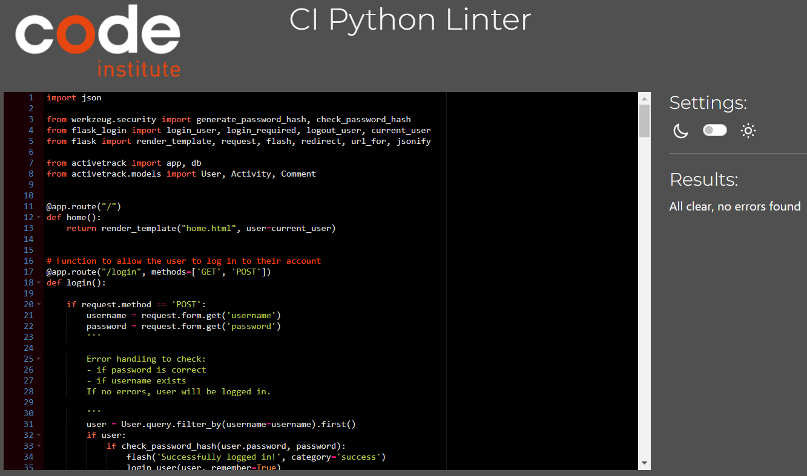

# ActiveTrack

[View live webpage](https://activetrack-milestone-3-d2dff2fa8baa.herokuapp.com/)

## Testing

Testing was conducted continuously throughout the entire project development process. Google Developer Tools was used to highlight any issues during development.

Google Developer Tools was used to test the site on various device sizes.

The following devices were used to test the site:

- 32" (3840 x 2160) Desktop Monitor
- 15.6" (1920 x 1080) ASUS Laptop
- iPad Tablet
- Samsung S23 Mobile
- iPhone 12 Mobile

The following browsers were used to test the site:

- Google Chrome
- Mozilla Firefox
- Safari

### Code Validation

#### HTML Validation

[W3C Markup Validation Service](https://validator.w3.org/) was used to validate the HTML. No errors present.

Results:

[Home](https://validator.w3.org/nu/?doc=https%3A%2F%2Factivetrack-milestone-3-d2dff2fa8baa.herokuapp.com%2F)

[Sign Up](https://validator.w3.org/nu/?doc=https%3A%2F%2Factivetrack-milestone-3-d2dff2fa8baa.herokuapp.com%2Fsign-up)

[Login](https://validator.w3.org/nu/?doc=https%3A%2F%2Factivetrack-milestone-3-d2dff2fa8baa.herokuapp.com%2Flogin)

[Diary](https://validator.w3.org/nu/?doc=https%3A%2F%2Factivetrack-milestone-3-d2dff2fa8baa.herokuapp.com%2Fdiary)

[Activity Feed](https://validator.w3.org/nu/?doc=https%3A%2F%2Factivetrack-milestone-3-d2dff2fa8baa.herokuapp.com%2Factivity_feed)

[Add Activity](https://validator.w3.org/nu/?doc=https%3A%2F%2Factivetrack-milestone-3-d2dff2fa8baa.herokuapp.com%2Fadd_activity)

[Edit Activity](https://validator.w3.org/nu/?doc=https%3A%2F%2Factivetrack-milestone-3-d2dff2fa8baa.herokuapp.com%2Fedit_activity%2F2)

#### CSS Validation

[W3C CSS Validation Service](https://jigsaw.w3.org/css-validator/) was used to validate the CSS. No errors present.

[Home](https://jigsaw.w3.org/css-validator/validator?uri=https%3A%2F%2Factivetrack-milestone-3-d2dff2fa8baa.herokuapp.com%2F&profile=css3svg&usermedium=all&warning=1&vextwarning=&lang=en)

[Sign Up](https://jigsaw.w3.org/css-validator/validator?uri=https%3A%2F%2Factivetrack-milestone-3-d2dff2fa8baa.herokuapp.com%2Fsign-up&profile=css3svg&usermedium=all&warning=1&vextwarning=&lang=en)

[Login](https://jigsaw.w3.org/css-validator/validator?uri=https%3A%2F%2Factivetrack-milestone-3-d2dff2fa8baa.herokuapp.com%2Flogin&profile=css3svg&usermedium=all&warning=1&vextwarning=&lang=en)

[Diary](https://jigsaw.w3.org/css-validator/validator?uri=https%3A%2F%2Factivetrack-milestone-3-d2dff2fa8baa.herokuapp.com%2Fdiary&profile=css3svg&usermedium=all&warning=1&vextwarning=&lang=en)

[Activity Feed](https://jigsaw.w3.org/css-validator/validator?uri=https%3A%2F%2Factivetrack-milestone-3-d2dff2fa8baa.herokuapp.com%2Factivity_feed&profile=css3svg&usermedium=all&warning=1&vextwarning=&lang=en)

[Add Activity](https://jigsaw.w3.org/css-validator/validator?uri=https%3A%2F%2Factivetrack-milestone-3-d2dff2fa8baa.herokuapp.com%2Fadd_activity&profile=css3svg&usermedium=all&warning=1&vextwarning=&lang=en)

[Edit Activity](https://jigsaw.w3.org/css-validator/validator?uri=https%3A%2F%2Factivetrack-milestone-3-d2dff2fa8baa.herokuapp.com%2Fedit_activity%2F3&profile=css3svg&usermedium=all&warning=1&vextwarning=&lang=en)

#### JavaScript Validation

[JSHint](https://jshint.com/) was used to validate the Javascript files. No issues present.

script.js

#### Python Validation

[pep8ci Python Linter](https://pep8ci.herokuapp.com/) was used to validate the Python files and ensure pep8 compliance. No issues present.

init.py

models.py

routes.py

### Accessibility

[WAVE Web Accessibility Tool](https://wave.webaim.org/) was used to test for accessibility errors.

The login functionality restricts WAVE, limiting its access to certain links. However, the following pages were testable, all of which showed no errors or contrast issues. Since the untested pages follow the same code and design principles, the tested pages indicate that the site's pages are built with optimal accessibility.

[Home](https://wave.webaim.org/report#/https://activetrack-milestone-3-d2dff2fa8baa.herokuapp.com/)

[Sign Up](https://wave.webaim.org/report#/https://activetrack-milestone-3-d2dff2fa8baa.herokuapp.com/sign-up)

[Login](https://wave.webaim.org/report#/https://activetrack-milestone-3-d2dff2fa8baa.herokuapp.com/login)

### Lighthouse Testing

Google Lighthouse was used to test all pages. All pages performed well.

Home Mobile

Home Desktop

Sign Up Mobile

Sign Up Desktop

Login Mobile

Login Desktop

Diary Mobile

Diary Desktop

Activity Feed Mobile

Activity Feed Desktop

Add Activity Mobile

Add Activity Desktop

Edit Activity Mobile

Edit Activity Desktop

### Testing User Stories

